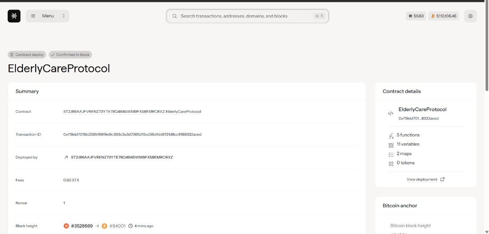

# ElderlyCare Protocol

## Project Description

The ElderlyCare Protocol is a decentralized blockchain-based system designed to revolutionize elderly care coordination by bringing together families, care providers, and quality assurance mechanisms on a transparent, immutable platform. This protocol enables families to register care plans for their elderly loved ones while maintaining oversight through a community-driven quality rating system.

The system addresses critical challenges in elderly care including lack of transparency, difficulty in coordinating between multiple stakeholders, and ensuring quality standards. By leveraging blockchain technology, the protocol creates an ecosystem where care services are documented, tracked, and rated in a tamper-proof manner.

Key features include:
- **Decentralized Care Plan Management**: Families can register comprehensive care plans specifying care types, schedules, and costs
- **Quality Assurance System**: Community-driven rating and feedback mechanism for care providers
- **Transparency & Trust**: All care arrangements and ratings are recorded on-chain for full transparency
- **Family-Centric Approach**: Empowers families to maintain oversight and control over elderly care decisions

## Project Vision

Our vision is to create a world where elderly care is transparent, accessible, and of the highest quality through decentralized coordination. We envision a future where:

- **Families have complete visibility** into the care their elderly receive
- **Care providers are incentivized** to maintain high standards through transparent ratings
- **Quality care becomes accessible** to more families through efficient coordination
- **Trust is built through transparency** rather than traditional intermediaries
- **Data ownership remains** with families while enabling community oversight
- **Care coordination transcends geographical boundaries** through decentralized infrastructure

The ElderlyCare Protocol aims to become the foundational layer for a new era of elderly care that prioritizes dignity, quality, and family involvement while leveraging the power of blockchain technology to ensure transparency and accountability.

## Contract Address Details

Contract ID : 

## Future Scope

The ElderlyCare Protocol is designed with scalability and extensibility in mind. Future development phases include:

### Phase 2: Enhanced Features
- **Smart Payment System**: Automated payments to care providers based on service delivery and quality ratings
- **Multi-signature Family Approvals**: Require consensus from multiple family members for major care decisions
- **Emergency Response Integration**: Automated alert system for emergency situations
- **Care Provider Verification**: Credential verification and certification tracking for care providers

### Phase 3: Advanced Analytics
- **Predictive Care Analytics**: AI-powered insights for care plan optimization
- **Health Outcome Tracking**: Integration with health monitoring devices and systems
- **Cost Optimization Tools**: Analytics to help families optimize care costs while maintaining quality
- **Regional Care Standards**: Location-based care standards and benchmarking

### Phase 4: Ecosystem Expansion
- **Insurance Integration**: Direct integration with insurance providers for seamless claims
- **Medical Professional Network**: Connect with doctors, nurses, and healthcare professionals
- **Care Marketplace**: Decentralized marketplace for care services and products
- **Mobile Application**: Full-featured mobile apps for families and care providers

### Phase 5: Interoperability
- **Cross-chain Compatibility**: Expand to multiple blockchain networks
- **Healthcare System Integration**: Connect with existing healthcare management systems
- **Government Services Integration**: Interface with government elderly care programs
- **International Standards Compliance**: Adapt to various international care standards

### Long-term Vision
- **Global Care Network**: Create a worldwide network of interconnected care communities
- **AI Care Assistants**: Integrate AI-powered care planning and monitoring
- **Preventive Care Focus**: Shift from reactive to proactive and preventive care models
- **Community Care Tokens**: Tokenized incentives for community involvement in elderly care
